# Excel Sales & Financial Analytics Dashboard

> **Comprehensive Sales & Financial Performance Analysis using Excel Power Tools**

[](https://www.microsoft.com/en-us/microsoft-365/excel)
[](https://docs.microsoft.com/en-us/power-query/)
[](https://docs.microsoft.com/en-us/dax/)

## Project Overview

This project delivers a comprehensive **Sales & Financial Analytics Dashboard** for AtliQ Hardware, transforming raw transactional data into actionable business insights. Built entirely in Excel using advanced analytics tools, it provides stakeholders with clear visibility into sales performance, market trends, and financial metrics.

### Interactive Demo


### About AtliQ Hardware

AtliQ Hardware is a leading electronics manufacturer specializing in:
- Personal computers and peripherals
- Mice, printers, and accessories
- Consumer electronics

**Distribution Channels:**
- **Retail Partners:** Croma, Best Buy, and other brick-and-mortar stores
- **E-commerce Platforms:** Amazon, Flipkart, and online marketplaces

## Report Preview

### Report Screenshots

| Report Type | Preview |
|-------------|---------|
| **P&L Fiscal Year Overview** | 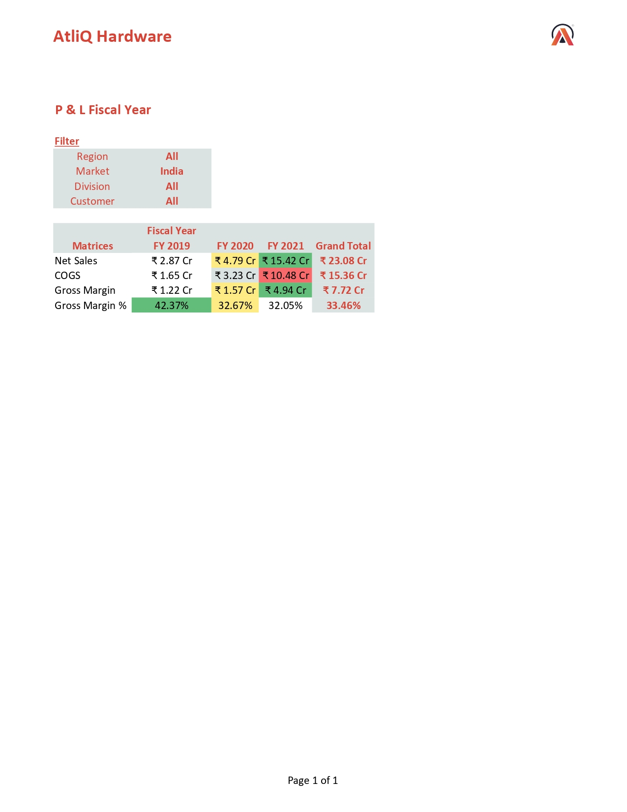 |
| **Monthly P&L Analysis** | 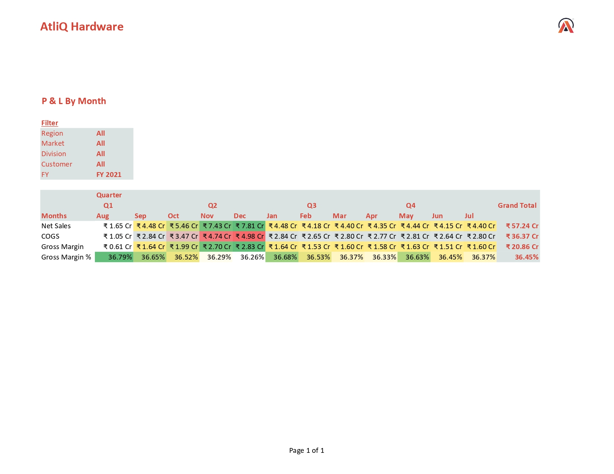 |
| **Net Sales Comparison** | 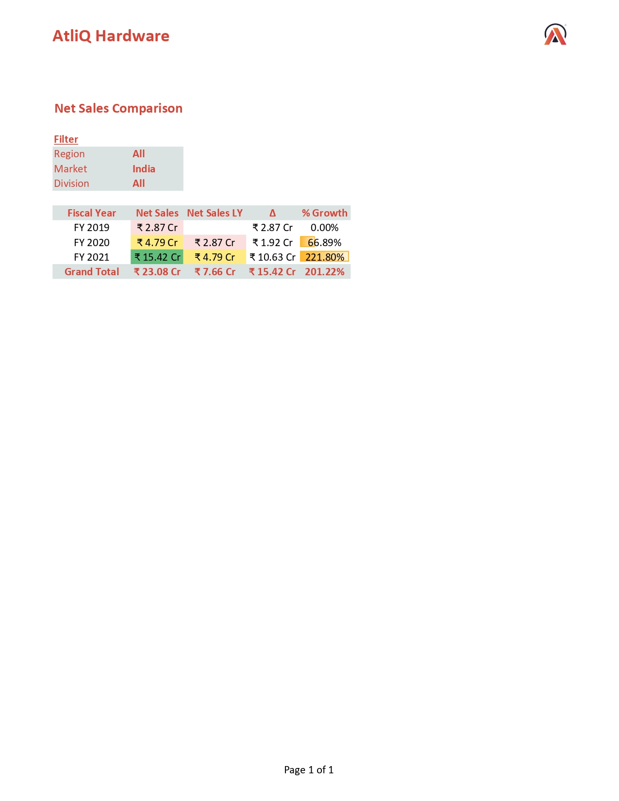 |
| **Market vs Target Performance** | 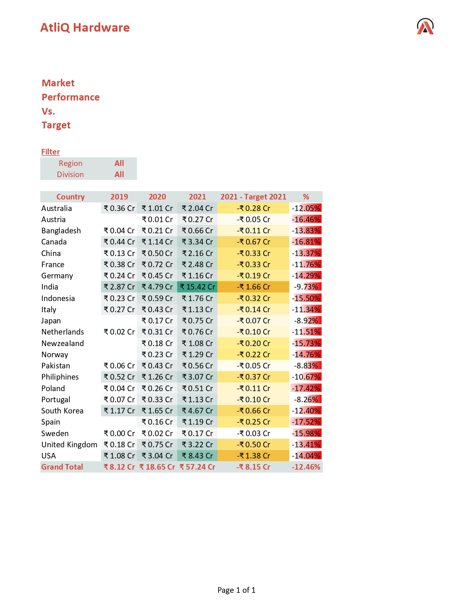 |
| **Customer Performance (Page 1)** | 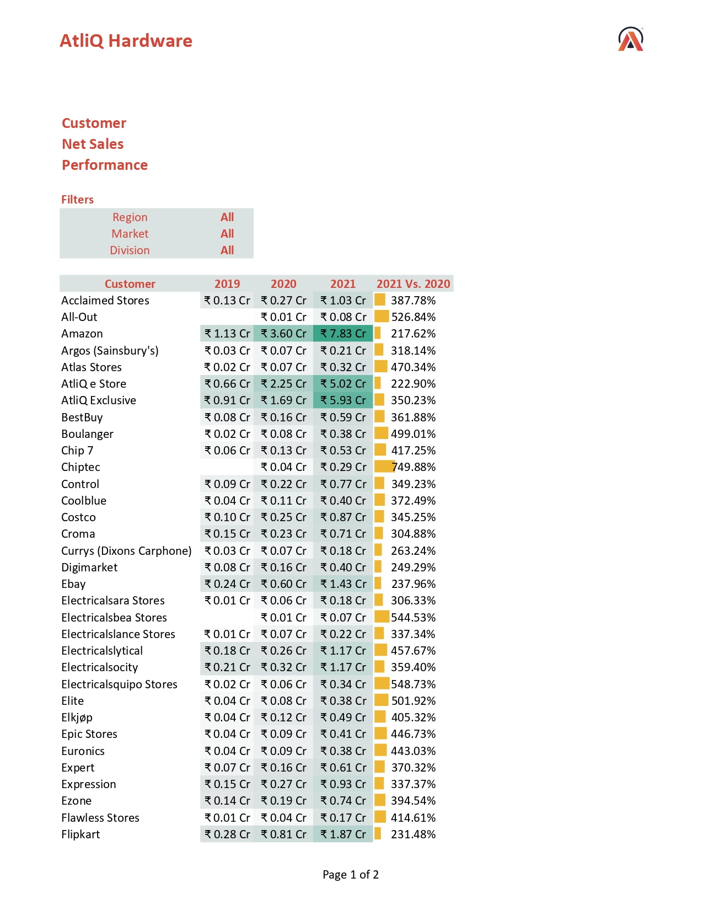 |
| **Customer Performance (Page 2)** | 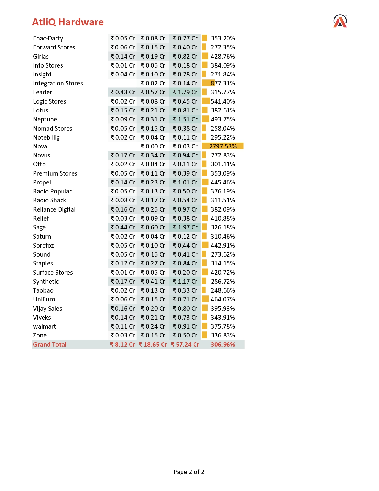 |
| **Data Model Relationships** | 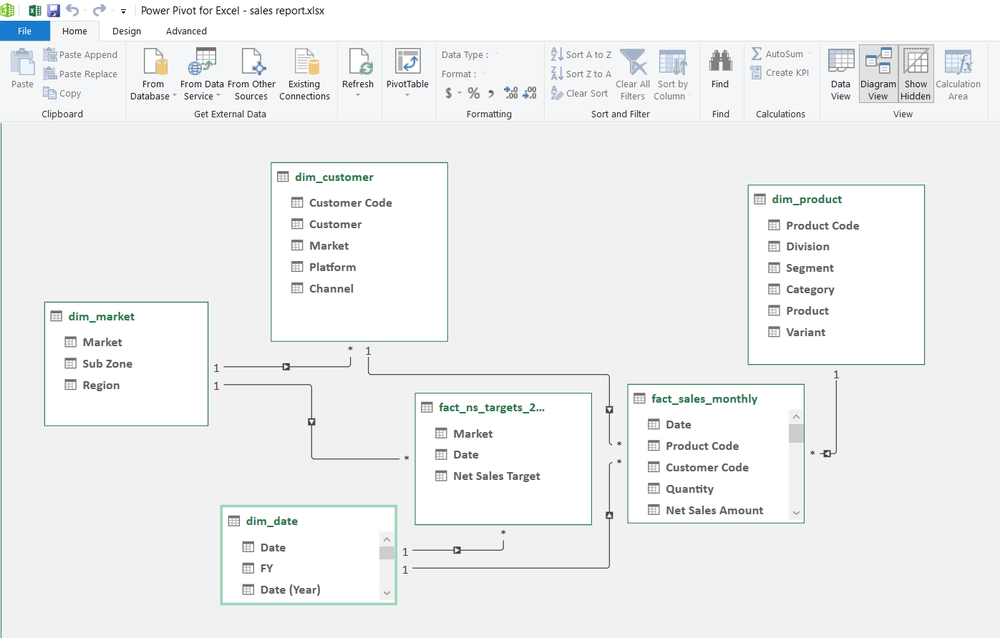 |

## Business Problem

AtliQ Hardware faced challenges with:
- **Manual Reporting:** Time-consuming, error-prone financial reports
- **Scattered Data:** Multiple data sources without centralized analysis
- **Limited Insights:** Lack of actionable business intelligence
- **Performance Tracking:** No systematic way to monitor sales targets vs. actuals

## Solution Delivered

A comprehensive Excel-based analytics solution featuring:
- **ETL Pipeline** using Power Query
- **Interactive Report** with filtering
- **Custom Financial Calendar** aligned with business needs
- **Advanced Calculations** using DAX measures
- **Multi-dimensional Analysis** across time, geography, and customers

## Dataset Information

| Attribute | Details |
|-----------|---------|
| **Total Records** | 799,962 transactions |
| **Time Period** | FY 2019 - FY 2021 |
| **Markets Covered** | Multiple countries including India, USA, Canada, Etc. |
| **Product Categories** | PCs, Peripherals, Accessories |

### Data Sources

1. **`fact_sales_monthly`** - Core sales transactions
2. **`fact_ns_targets_2021`** - Sales targets for FY 2021
3. **`dim_customer`** - Customer master data
4. **`dim_market`** - Market/geography information
5. **`dim_product`** - Product catalog
6. **`dim_date`** - Custom fiscal calendar

## Technical Implementation

### **Power Query (ETL)**

#### 1. Date Range Generation
```m
= List.Dates(#date(2018, 09, 01), 1100, #duration(1, 0, 0, 0))
```

#### 2. Custom Fiscal Year Logic
```m
= if Date.Month([date]) >= 8 
  then "FY " & Text.From(Date.Year([date])+1) 
  else "FY " & Text.From(Date.Year([date]))
```
### **DAX calculated column**

#### Date Table **`dim_date`**

###### 1. Fiscal Month Number
```dax
= MOD(
	MONTH(dim_date[Date]) - 8,
	12
	)
	+ 1
```

###### 2. Fiscal Month Name
```dax
= SWITCH( 
    dim_date[Fiscal Month Number],
    1, "Aug",
    2, "Sep",
    3, "Oct",
    4, "Nov",
    5, "Dec",
    6, "Jan",
    7, "Feb",
    8, "Mar",
    9, "Apr",
    10, "May",
    11, "Jun",
    12, "Jul"
)
```

###### 3. Fiscal Quarter
```dax
= SWITCH(
	TRUE(),
	MONTH(dim_date[Date]) IN {8, 9, 10}, "Q1",
	MONTH(dim_date[Date]) IN {11, 12, 1}, "Q2",
	MONTH(dim_date[Date]) IN {2, 3, 4}, "Q3",
	MONTH(dim_date[Date]) IN {5, 6, 7}, "Q4"
	)
```
### **DAX Measures**

#### Financial Metrics

###### 1. Net Sales
```dax
Net Sales = SUM(fact_sales_monthly[Net Sales Amount])
```

###### 2. COGS
```dax
COGS = SUM(fact_sales_monthly[Freight Cost]) + 
       SUM(fact_sales_monthly[Manufacturing Cost])
```

###### 3. Gross Margin
```dax
Gross Margin = [Net Sales] - [COGS]
```

###### 4. Gross Margin %
```dax
Gross Margin % = DIVIDE([Gross Margin], [Net Sales], 0)
```

#### Growth Analytics

###### 1. Net Sales Last Year
```dax
Net Sales LY = CALCULATE([Net Sales], SAMEPERIODLASTYEAR(dim_date[Date]))
```

###### 2. Net Sales Change
```dax
Net Sales Change = [Net Sales] - [Net Sales LY]
```

###### 3. % Growth
```dax
% Growth = DIVIDE([Net Sales Change], [Net Sales LY], 0)
```

#### Target Analysis

###### 1. Target 2021
```dax
Target 2021 = SUM(fact_ns_targets_2021[Net Sales Target])
```

###### 2. 2021 vs Target
```dax
2021 vs Target = [2021] - [Target 2021]
```

### **Technology Stack**

| Tool | Purpose | Features Used |
|------|---------|---------------|
| **Excel** | Primary Platform | Pivot Tables, Conditional Formatting |
| **Power Query** | Data Transformation | ETL, Data Cleaning, Custom Columns |
| **Power Pivot** | Data Modeling | Relationships, Calculated Columns |
| **DAX** | Business Logic | Time Intelligence, Calculations |

## Business Insights

### **Explosive Growth Story**
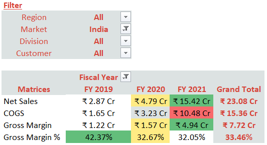
- **Net Sales Growth:** ₹2.87 Cr (FY19) → ₹15.42 Cr (FY21)
- **Growth Multiple:** **5.37x increase** over 3 years
- **FY21 Performance:** **222% YoY growth** - breakthrough year

### **Seasonal Trends**
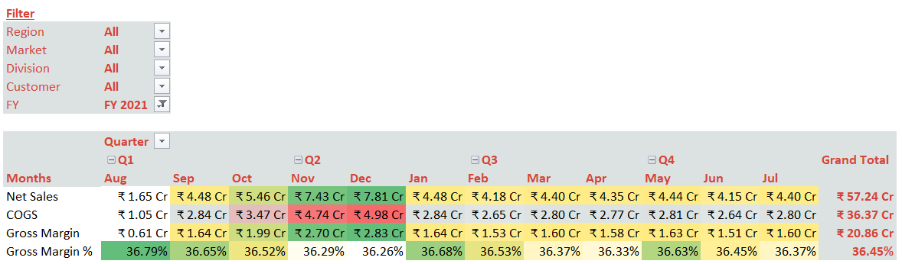
- **Peak Month:** December FY21 (₹7.81 Cr)
- **Growth Pattern:** Strong Q2 performance (Oct-Dec)
- **Opportunity:** Leverage festive season strategies

### **Market Performance**
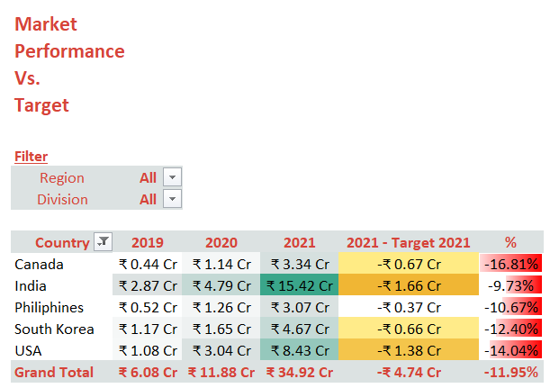
- **Top Market:** India (₹15.42 Cr in FY21)
- **Challenge:** All markets missed FY21 targets
- **Action Required:** Reassess forecasting methodology

### **Customer Diversification**
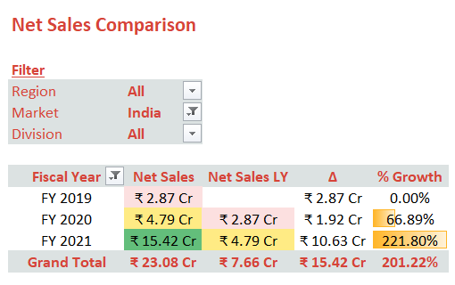
- **India Growth:** 321.8% YoY (₹4.79 Cr → ₹15.42 Cr)
- **Top Contributors:** Amazon, AtliQ Exclusive, Flipkart
- **Risk Mitigation:** No single customer >14% dependency

## Strategic Recommendations

### **Performance Optimization**
1. **Target Setting:** Implement data-driven forecasting models
2. **Market Expansion:** Focus resources on high-growth markets
3. **Seasonal Planning:** Capitalize on Q2 peak performance patterns

### **Analytical Enhancements**
1. **Profitability Analysis:** Deep-dive into product-wise margins
2. **Customer Segmentation:** Develop targeted retention strategies
3. **Competitive Analysis:** Benchmark against industry standards

## Getting Started

### **Prerequisites**
- Microsoft Excel 2016 or later
- Power Query Add-in (if using Excel 2010-2013)
- Basic understanding of Excel formulas

## Contact Me

**Durgesh Nautiyal**
- LinkedIn: [My LinkedIn Profile](https://www.linkedin.com/in/durgesh-nautiyal-95a866223/)
- Email: durgeshnautiyal11@gmail.com
